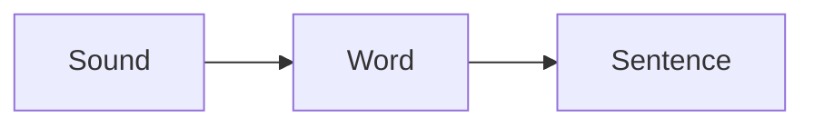

# Lexora

Lexora is a multilingual language-learning space for reading, practicing, and revisiting lessons across languages.

## Scripts

```bash
npm run dev
npm run build
npm run build:github
npm run build:cloudflare
npm run lint
npm run format
```

`predev` and `prebuild` refresh the lesson index from the `content/` folder.

The same content refresh also creates:

- `public/search-index.json`
- `public/sitemap.xml`
- typed generated indexes in `src/generated/`

## Content

Current languages live in:

```text
content/
  sanskrit/
    _config.json
    basics.mdx
    grammar.mdx
    words.mdx
    sentences.mdx
  kannada/
    _config.json
    basics.mdx
    greetings.mdx
    words.mdx
    sentences.mdx
```

To add Tamil later:

```text
content/
  tamil/
    _config.json
    basics.mdx
    greetings.mdx
```

Then run:

```bash
npm run generate-content
```

Each `_config.json` controls the language label, native name, locale, description, and page order.
Search and sitemap files update from this same command.

## Lesson Writing Examples

Use callouts to guide learners through tricky ideas:

```mdx
:::tip
Read the word aloud before checking the meaning.
:::
```

Use reveal blanks for active recall:

```mdx
ನಮಸ್ಕಾರ means [[hello]].
```

Use diagrams for grammar flow or sentence structure:

````mdx

````

Use icons when a lesson needs a quick visual marker:

```mdx
# Greetings :icon[MessageSquareText]
```

## GitHub Pages

GitHub Pages uses a base path:

```bash
NEXT_PUBLIC_BASE_PATH=/lexora npm run build
```

The included workflow deploys the static `out/` directory to:

```text
https://actionanand.github.io/lexora/
```

## Cloudflare Pages

Cloudflare Pages deploys at the root path:

```bash
npm run build:cloudflare
```

See `CLOUDFLARE_PAGES.md` for setup notes.
