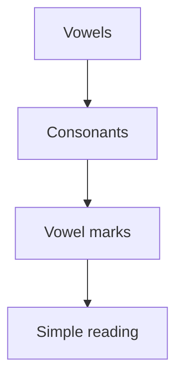

# Kannada Basics :icon[BookOpen]

Kannada is written with a rounded script. Start by recognizing vowels, then combine consonants and vowel marks.

:::note
Read slowly at first. Accuracy matters more than speed while the script is still new.
:::

## Script Shape

| Letter | Sound | Example Hint |
| --- | --- | --- |
| ಅ | a | short vowel |
| ಆ | aa | long vowel |
| ಕ | ka | consonant with vowel |
| ಕಿ | ki | consonant plus vowel mark |

## Reveal

The Kannada word ಕನ್ನಡ means [[Kannada]].

## Learning Flow

