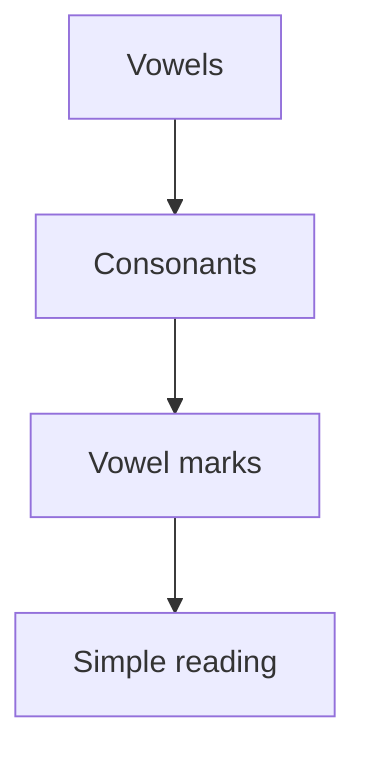

# Kannada Basics :icon[BookOpen]

Kannada is written with a rounded script. Start by recognizing vowels, then combine consonants and vowel marks.

:::note
Read slowly at first. Accuracy matters more than speed while the script is still new.
:::

## Script Shape

| Letter | Sound | Example Hint |
| --- | --- | --- |
| ಅ | a | short vowel |
| ಆ | aa | long vowel |
| ಕ | ka | consonant with vowel |
| ಕಿ | ki | consonant plus vowel mark |

## Reveal Practice

Use double brackets around the answer and a sentence template to make reveal practice. If the template does not include `___`, Lexora places the blank at the end of the sentence.

Write it like this:

- Blank at the end: `[[Kannada|The Kannada word ಕನ್ನಡ means]]`
- Blank anywhere: `[[ಕನ್ನಡ|The Kannada word ___ means Kannada.]]`

It appears like this:

[[Kannada|The Kannada word ಕನ್ನಡ means]]

[[ಕನ್ನಡ|The Kannada word ___ means Kannada.]]

## Learning Flow

