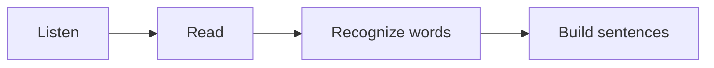

# Sanskrit Basics :icon[BookOpen]

Sanskrit is usually learned through sound first. Read slowly, keep the vowel length clear, and let each syllable land cleanly.

:::note
Short vowels and long vowels can change meaning. Treat `a` and `ā` as different sounds, not as decorative marks.
:::

## Sound And Script

Devanagari is written from left to right. Many consonants carry an inherent `a` sound unless a vowel mark or virama changes it.

| Pattern | Example | Hint |
| --- | --- | --- |
| अ | a | short open vowel |
| आ | ā | long open vowel |
| क | ka | consonant with inherent vowel |
| की | kī | consonant with vowel mark |

## First Reveal

Click the blank to reveal the answer: नमस्ते means [[hello]].

## Picture Word Practice

Use `imageWord` when a learner should connect a word with a small visual, transliteration, and meaning. The image name comes from `src/app/dataImg/png/index.ts`, and the generator includes only the image names used in lessons.

Add a new PNG base64 image like this:

```ts
// src/app/dataImg/png/house.ts
export const HOUSE = `data:image/png;base64,...`;
```

Then export it from the index:

```ts
// src/app/dataImg/png/index.ts
export * from "./house";
```

After that, use the export name in any lesson. You do not need to paste base64 into the article, and you do not need to edit the renderer. Only names exported from the folder `index.ts` are available. `HOUSE` becomes `house`, and `BOY` becomes `boy`. Names with underscores can be written with dashes, so `SCHOOL_BAG` becomes `school-bag`.

SVG works the same way from `src/app/dataImg/svg/index.ts`:

```ts
// src/app/dataImg/svg/lotus.ts
export const LOTUS = `data:image/svg+xml;base64,...`;
```

```ts
// src/app/dataImg/svg/index.ts
export * from "./lotus";
```

Use `imageWord` for PNG exports and `svgWord` for SVG exports. If you omit `size`, Lexora uses `huge`.
Use `meaningTamil` only when you want to show an extra Tamil meaning.

```md
:imageWord[boy]{label="बालकः" transliteration="balakah" meaning="boy" meaningTamil="சிறுவன்"}
:imageWord[girl]{label="बालिका" transliteration="balika" meaning="girl" size="big"}
:imageWord[old_woman]{label="वृद्धा" transliteration="Vṛddhā" meaning="old woman" size="huge"}
:svgWord[peacock]{label="मयूरः" transliteration="mayurah" meaning="peacock" meaningTamil="மயில்"}
```

Available sizes are `normal`, `medium`, `big`, and `huge`. The default is `huge`.

:imageWord[boy]{label="बालकः" transliteration="balakah" meaning="boy" meaningTamil="சிறுவன்"}
:imageWord[girl]{label="बालिका" transliteration="balika" meaning="girl" size="big"}
:imageWord[old_woman]{label="वृद्धा" transliteration="Vṛddhā" meaning="old woman" size="huge"}
:svgWord[peacock]{label="मयूरः" transliteration="mayurah" meaning="peacock" meaningTamil="மயில்"}

Use `textWord` when you want the same label, transliteration, and meaning format without an image.

```md
:textWord[गृहम्]{transliteration="grham" meaning="home" meaningTamil="வீடு"}
:textWord[जलम्]{transliteration="jalam" meaning="water" size="big"}
```

:textWord[गृहम्]{transliteration="grham" meaning="home" meaningTamil="வீடு"}
:textWord[जलम्]{transliteration="jalam" meaning="water" size="big"}

Use `sentence` for sentence practice. Mark one or two important words with `==highlight==`.

```md
:sentence[किं ==कुर्वन्ति==]{transliteration="kim kurvanti" meaning="What are they doing?" meaningTamil="அவர்கள் என்ன செய்கிறார்கள்?"}
:sentence[बालकः उद्याने ==फलानि== ==खादति==]{transliteration="balakah udyane phalani khadati" meaning="The boy eats fruits in the garden." meaningTamil="சிறுவன் தோட்டத்தில் பழங்களை சாப்பிடுகிறான்."}
:sentence[सीता पठति]{meaning="Sita reads."}
```

:sentence[किं ==कुर्वन्ति==]{transliteration="kim kurvanti" meaning="What are they doing?" meaningTamil="அவர்கள் என்ன செய்கிறார்கள்?"}

:sentence[बालकः उद्याने ==फलानि== ==खादति==]{transliteration="balakah udyane phalani khadati" meaning="The boy eats fruits in the garden." meaningTamil="சிறுவன் தோட்டத்தில் பழங்களை சாப்பிடுகிறான்."}

:sentence[सीता पठति]{meaning="Sita reads."}

:::boy
Say `बालकः` slowly: `balakah`.
:::

:::girl{align="right"}
Then compare it with `बालिका`: `balika`.
:::

## Learning Flow



:::tip
Practice five minutes of reading aloud before moving into grammar. The script becomes friendlier when your mouth knows the pattern.
:::
