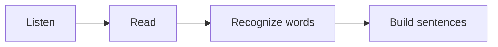

# Sanskrit Basics :icon[BookOpen]

Sanskrit is usually learned through sound first. Read slowly, keep the vowel length clear, and let each syllable land cleanly.

:::note
Short vowels and long vowels can change meaning. Treat `a` and `ā` as different sounds, not as decorative marks.
:::

## Sound And Script

Devanagari is written from left to right. Many consonants carry an inherent `a` sound unless a vowel mark or virama changes it.

| Pattern | Example | Hint |
| --- | --- | --- |
| अ | a | short open vowel |
| आ | ā | long open vowel |
| क | ka | consonant with inherent vowel |
| की | kī | consonant with vowel mark |

## First Reveal

Click the blank to reveal the answer: नमस्ते means [[hello]].

## Learning Flow

:::tip
Practice five minutes of reading aloud before moving into grammar. The script becomes friendlier when your mouth knows the pattern.
:::
