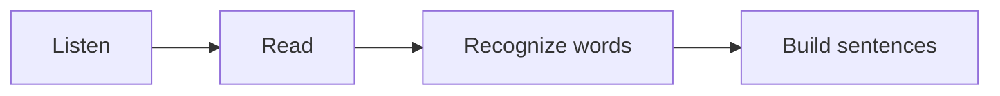

# Sanskrit Basics :icon[BookOpen]

Sanskrit is usually learned through sound first. Read slowly, keep the vowel length clear, and let each syllable land cleanly.

:::note
Short vowels and long vowels can change meaning. Treat `a` and `ā` as different sounds, not as decorative marks.
:::

## Sound And Script

Devanagari is written from left to right. Many consonants carry an inherent `a` sound unless a vowel mark or virama changes it.

| Pattern | Example | Hint |
| --- | --- | --- |
| अ | a | short open vowel |
| आ | ā | long open vowel |
| क | ka | consonant with inherent vowel |
| की | kī | consonant with vowel mark |

## First Reveal

Click the blank to reveal the answer: नमस्ते means [[hello]].

## Picture Word Practice

Use `imageWord` when a learner should connect a word with a small visual, transliteration, and meaning. The image name comes from `src/app/dataImg/png/index.ts`, and the generator includes only the image names used in lessons.

Add a new base64 image like this:

```ts
// src/app/dataImg/png/house.ts
export const HOUSE = `data:image/png;base64,...`;
```

Then export it from the index:

```ts
// src/app/dataImg/png/index.ts
export * from "./house";
```

After that, use the export name in any lesson. You do not need to paste base64 into the article. `HOUSE` becomes `house`, and `BOY` becomes `boy`. Names with underscores can be written with dashes, so `SCHOOL_BAG` becomes `school-bag`.

```md
:imageWord[boy]{label="बालकः" transliteration="balakah" meaning="boy" size="huge"}
:imageWord[girl]{label="बालिका" transliteration="balika" meaning="girl" size="big"}
:imageWord[old_woman]{label="वृद्धा" transliteration="Vṛddhā" meaning="old woman" size="huge"}
```

Available sizes are `normal`, `medium`, `big`, and `huge`.

:imageWord[boy]{label="बालकः" transliteration="balakah" meaning="boy" size="huge"}
:imageWord[girl]{label="बालिका" transliteration="balika" meaning="girl" size="big"}
:imageWord[old_woman]{label="वृद्धा" transliteration="Vṛddhā" meaning="old woman" size="huge"}

:::boy
Say `बालकः` slowly: `balakah`.
:::

:::girl{align="right"}
Then compare it with `बालिका`: `balika`.
:::

## Learning Flow



:::tip
Practice five minutes of reading aloud before moving into grammar. The script becomes friendlier when your mouth knows the pattern.
:::
