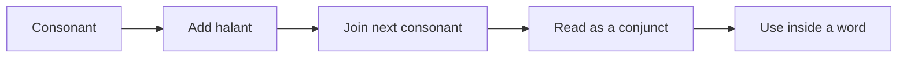

# Conjunct Consonants :icon[Combine]

Conjunct consonants appear when two or more consonants meet without an intervening vowel. In Devanagari, the first consonant usually takes a **halant** and joins the next consonant.

:::tip[Reading rule]
Read the pure consonant first, then attach the next consonant quickly. The vowel sound usually comes at the end of the joined cluster.
:::

## Basic Pattern

| Pure consonants | Conjunct | IAST |
| --- | --- | --- |
| क् + ष | क्ष | kṣa |
| त् + र | त्र | tra |
| ज् + ञ | ज्ञ | jña |
| द् + य | द्य | dya |
| क् + त | क्त | kta |
| त् + त | त्त | tta |

## Visual Practice

:letterGrid[Conjuncts]{cols="3" layout="stack" items="क्ष=kṣa, त्र=tra, ज्ञ=jña, द्य=dya, क्त=kta, त्त=tta"}

Notice how some conjuncts look predictable, while others become special shapes. **क्ष**, **त्र**, and **ज्ञ** are especially common, so learn them as whole reading units.

## Words With Conjuncts

| Word | Split | Meaning |
| --- | --- | --- |
| कुक्कुटः | कु + क् + कु + टः | rooster |
| रिक्तम् | रि + क् + तम् | empty |
| शिक्षकः | शि + क्ष + कः | teacher |
| परिशुद्धः | प + रि + शु + द् + धः | pure |
| मध्याह्ने | म + ध् + या + ह्ने | at noon |
| स्त्री | स् + त्री | woman |

## Words To Alphabets

Read the word, then trace how its letters combine.

| Word | Break it apart |
| --- | --- |
| माता | म् + आ + त् + आ |
| मयूरः | म् + अ + य् + ऊ + र् + अः |
| वृषभः | व् + ऋ + ष् + अ + भ् + अः |
| कपोतः | क् + अ + प् + ओ + त् + अः |
| भयम् | भ् + अ + य् + अ + म् |
| धेनुः | ध् + ए + न् + उः |
| तैलम् | त् + ऐ + ल् + अ + म् |
| मौनम् | म् + औ + न् + अ + म् |
| वेणी | व् + ए + ण् + ई |

:::note[Halant reminder]
Without a halant, **क** reads as *ka*. With a halant, **क्** reads as pure *k*. Pure consonants are the building blocks of conjuncts.
:::

## Fill In Practice

Use the reveal blank when you want the learner to try the missing word first. You can now add optional transliteration and meaning hints.

```md
[[धावति|सिंहः ___|meaning=The lion runs]]
[[धावति|सिंहः ___|transliteration=siṃhaḥ dhāvati|meaning=The lion runs]]
```

[[धावति|सिंहः ___|meaning=The lion runs]]

[[धावति|सिंहः ___|transliteration=siṃhaḥ dhāvati|meaning=The lion runs]]

## Quick Check

- [[क्ष|क् + ष becomes ___|transliteration=kṣa|meaning=the conjunct kṣa]]
- [[त्र|त् + र becomes ___|transliteration=tra|meaning=the conjunct tra]]
- [[ज्ञ|ज् + ञ becomes ___|transliteration=jña|meaning=the conjunct jña]]


