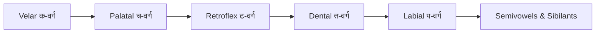

# Lesson 2: Sanskrit Consonants — व्यञ्जनानि :icon[BookOpen]

After the vowels come the consonants — called **व्यञ्जन** (*vyañjana*, plural **व्यञ्जनानि** *vyañjanāni*). Unlike vowels, every consonant carries an inherent **अ** (*a*) sound unless a vowel mark or a **halant** removes it. Sanskrit organises its consonants by *where in the mouth* they are produced, which makes them surprisingly easy to memorise.

:::tip{title="How to use this lesson"}
Read each row left to right. Notice how the sounds move from the back of the throat (velar) to the lips (labial). The last letter in every categorized row is the **nasal** of that group — shown in yellow because it behaves differently.
:::

## Categorized Consonants — वर्गीय व्यञ्जन

These 25 consonants are the **stops** (**स्पर्श**, *sparśa*). In Sanskrit grammar they are called **वर्गीय** (*vargīya*, categorized), because they form a neat **5 × 5** grid: five groups (**वर्ग**, *varga*), each with five letters. The fifth letter in each row is the **nasal** (**अनुनासिक**, *anunāsika*, plural **अनुनासिकाः** *anunāsikāḥ*) of that group.

:letterGrid[Consonants]{cols="5" layout="stack" items="क=k, ख=kh, ग=g, घ=gh, *ङ=ṅ, च=c, छ=ch, ज=j, झ=jh, *ञ=ñ, ट=ṭ, ठ=ṭh, ड=ḍ, ढ=ḍh, *ण=ṇ, त=t, थ=th, द=d, ध=dh, *न=n, प=p, फ=ph, ब=b, भ=bh, *म=m"}

Each row has a name based on its place of articulation:

| Group (वर्ग) | Sanskrit name | Place | Letters |
| --- | --- | --- | --- |
| **क-वर्ग** | **कण्ठ्य** (*kaṇṭhya*) | Velar / throat | क ख ग घ **ङ** |
| **च-वर्ग** | **तालव्य** (*tālavya*) | Palatal | च छ ज झ **ञ** |
| **ट-वर्ग** | **मूर्धन्य** (*mūrdhanya*) | Retroflex | ट ठ ड ढ **ण** |
| **त-वर्ग** | **दन्त्य** (*dantya*) | Dental | त थ द ध **न** |
| **प-वर्ग** | **ओष्ठ्य** (*oṣṭhya*) | Labial / lips | प फ ब भ **म** |

:::note
Within each row the pattern is always the same: **unvoiced → unvoiced aspirated → voiced → voiced aspirated → nasal**. Learn this rhythm once and it repeats for all five groups.
:::

## Uncategorized Consonants — अवर्गीय व्यञ्जन

The remaining consonants do not belong to any *varga* group. They are called **अवर्गीय** (*avargīya*, uncategorized) and split into two families — **semivowels** (**अन्तःस्थ**, *antaḥstha*) and **sibilants & aspirate** (**ऊष्म**, *ūṣma*).

:letterGrid[Consonants]{cols="4" layout="stack" items="य=y, र=r, ल=l, व=v, श=ś, ष=ṣ, स=s, ह=h"}

- **Semivowels — अन्तःस्थ** (*antaḥstha*): :letter[य]{transliteration="ya" size="small"} :letter[र]{transliteration="ra" size="small"} :letter[ल]{transliteration="la" size="small"} :letter[व]{transliteration="va" size="small"}
- **Sibilants & aspirate — ऊष्म** (*ūṣma*): :letter[श]{transliteration="śa" size="small"} :letter[ष]{transliteration="ṣa" size="small"} :letter[स]{transliteration="sa" size="small"} :letter[ह]{transliteration="ha" size="small"}

## Pure Consonants And The Halant

A consonant on its own always includes the inherent **अ** (*a*) sound: **क** is read *ka*, not *k*.

To write a **pure consonant** (with no vowel), a slanting stroke called the **halant** (**हलन्त्**, *halant* — also *virāma*, **विराम**) is added below it.

:::info{title="Slanting stroke = halant"}
A consonant **without** the slanting stroke is mixed with the vowel *a* → **क** = *ka*.
A consonant **with** the slanting stroke is pure → **क्** = *k*.
:::

## Special Consonants

Two rare retroflex consonants survive in Vedic texts and related languages:

:letter[ळ]{transliteration="ḷa" meaning="like ள in குளம் (pond)" size="big"}
:letter[ऴ]{transliteration="ẓa" meaning="like ழ in பழம் (fruit)" size="big"}

- **ळ** (*ḷa*) — a retroflex lateral. Pronounced like **ள** in **குளம்** (*kuḷam*, pond). Found in Vedic recitation and still used in Marathi. Classical Sanskrit usually replaces it with **ल** (*la*).
- **ऴ** (*ẓa*) — an ancient retroflex. Pronounced like **ழ** in **பழம்** (*paẓam*, fruit). Appears only in the oldest Vedic texts and is no longer used in standard Sanskrit.

## Quick Check

Reveal the answers only after you try.

- [[ङ(ṅ)|The nasal of the **कण्ठ्य** (velar) group is _____ ]].
- [[हलन्त् (halant)|The slanting stroke that removes the inherent *a* is called the ]]
- [[अ (a)|A consonant with no vowel mark is read with an inherent ___ sound]].

## Learning Flow

:::tip{title="Next lesson"}
With vowels and consonants in place, you are ready to combine them into **syllables** using vowel marks (*mātrā*, **मात्रा**).
:::
