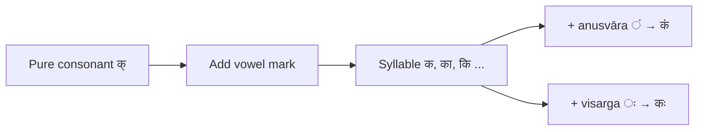

# Lesson 3: Vowel Marks — मात्रा :icon[BookOpen]

Every Sanskrit syllable is a consonant carrying a vowel. The symbol that attaches a vowel to a consonant is called a **मात्रा** (*mātrā*, vowel mark). Once you understand this, you can read and write any syllable in the language.

:::tip{title="How to use this lesson"}
Work through each section in order. The first section gives the general rule; the second shows how **anusvāra** and **visarga** follow the same rule — which is the main concept in this lesson.
:::

---

## How A Syllable Forms

Every consonant in its base form carries the inherent vowel **अ** (*a*). Writing the **halant** (**्**, *halant* or *virāma*) below a consonant removes that inherent vowel, leaving a **pure consonant**.

| Pure consonant |  Vowel |  Syllable |
| --- | --- | --- |
| क् (*k*) | + अ (*a*, inherent) | = **क** (*ka*) |
| क् (*k*) | + आ (*ā*) | = **का** (*kā*) |
| क् (*k*) | + इ (*i*) | = **कि** (*ki*) |
| क् (*k*) | + ई (*ī*) | = **की** (*kī*) |
| क् (*k*) | + उ (*u*) | = **कु** (*ku*) |
| क् (*k*) | + ऊ (*ū*) | = **कू** (*kū*) |
| क् (*k*) | + ए (*e*) | = **के** (*ke*) |
| क् (*k*) | + ऐ (*ai*) | = **कै** (*kai*) |
| क् (*k*) | + ओ (*o*) | = **को** (*ko*) |
| क् (*k*) | + औ (*au*) | = **कौ** (*kau*) |

:::note
A standalone vowel like **अ** or **आ** can appear on its own at the start of a word. However, the *mātrā* — the diacritic shape used when a vowel *attaches to a consonant* — cannot appear without a consonant as its base. The shape of the mark changes for each vowel, but the consonant beneath it stays recognisable.
:::

---

## Anusvāra And Visarga As Vowel Companions

The **अनुस्वार** (*anusvāra*, ं) and **विसर्ग** (*visarga*, ः) are not standalone vowels. They are sounds that ride on top of a vowel. The same combination rule applies:

**Pure consonant + vowel carrying anusvāra = syllable with nasal resonance**

| Devanagari equation | IAST equation |
| --- | --- |
| क् + अं = **कं** | k + aṃ = **kaṃ** |
| क् + अः = **कः** | k + aḥ = **kaḥ** |

The anusvāra adds a nasal hum after the vowel; the visarga adds a breathy echo. Neither can be spoken on its own — they are always pronounced *along with* the vowel they follow.

:::caution
You cannot say **ं** or **ः** without a vowel before them. They are modifiers, not independent sounds.
:::

---

## All Vowels With Anusvāra (anusvāra forms)

The anusvāra mark (ं) can follow any vowel. The resulting forms are used throughout the language — most commonly for words ending in *-aṃ* (accusative neuter), *-ānāṃ* (genitive plural), and nasalised roots.

:letterGrid[Anusvāra ं]{cols="6" layout="stack" items="अं=aṃ|அம், आं=āṃ|ஆம், इं=iṃ|இம், ईं=īṃ|ஈம், उं=uṃ|உம், ऊं=ūṃ|ஊம், ऋं=ṛṃ|ரும், ॠं=ṝṃ|ரூம், एं=eṃ|ஏம், ऐं=aiṃ|ஐம், ओं=oṃ|ஓம், औं=auṃ|ஔம்"}

Read each form as the vowel sound followed by a gentle nasal hum at the back of the nose.

---

## All Vowels With Visarga (visarga forms)

The visarga mark (ः) can follow any vowel in the same way. The visarga is common at the end of nouns and verbs in many grammatical forms.

:letterGrid[Visarga ः]{cols="6" layout="stack" items="अः=aḥ|அஹ, आः=āḥ|ஆஹ, इः=iḥ|இஹி, ईः=īḥ|ஈஹி, उः=uḥ|உஹு, ऊः=ūḥ|ஊஹு, ऋः=ṛḥ|ருஹு, ॠः=ṝḥ|ரூஹு, एः=eḥ|ஏஹெ, ऐः=aiḥ|ஐஹை, ओः=oḥ|ஓஹொ, औः=auḥ|ஔஹு"}

Read each form as the vowel sound followed by a soft aspiration — almost like a faint *h* at the end.

---

## The Key Rule

:::info{title="Remember"}
**अनुस्वार** and **विसर्ग** are pronounced *with* their vowel — never alone.

- **कं** = the vowel **अ** + nasal hum → *kaṃ*
- **कः** = the vowel **अ** + breathy echo → *kaḥ*

They follow the same rule as every other vowel mark: the consonant comes first, the sound modifier rides on the vowel.
:::

:::boy
Try saying **नमः** (*namaḥ*, salutation) aloud — the visarga at the end is a soft breath after the vowel **अ**, not a separate syllable.
:::

---

## Complete Syllable Map For क

Here is the full set of syllables built from one consonant क (*k*) combined with every vowel, including the anusvāra and visarga forms:

| Syllable | Transliteration | Vowel used |
| --- | --- | --- |
| **क** | *ka* | inherent अ |
| **का** | *kā* | आ |
| **कि** | *ki* | इ |
| **की** | *kī* | ई |
| **कु** | *ku* | उ |
| **कू** | *kū* | ऊ |
| **कृ** | *kṛ* | ऋ |
| **के** | *ke* | ए |
| **कै** | *kai* | ऐ |
| **को** | *ko* | ओ |
| **कौ** | *kau* | औ |
| **कं** | *kaṃ* | अ + anusvāra |
| **कः** | *kaḥ* | अ + visarga |
| **क्** | *k* | none — halant |

This same pattern holds for **every consonant** in the language. Learn it once with क and it transfers immediately.

---

## Quick Check

- [[हलन्त् (halant)|The symbol that removes the inherent vowel from a consonant is the ___]].
- [[कं is read as kaṃ|___ — the consonant **क् (k)** plus vowel **अ (a)** plus anusvāra **ः**]].
- [[along with|Anusvāra and visarga are pronounced ___ the vowel, never on their own]].

## Learning Flow

:::tip{title="Next lesson"}
With vowel marks in hand, you can read any simple Sanskrit word. The next step is combining two consonants without a vowel between them — the **conjunct consonants** (*saṃyukta*, **संयुक्त**).
:::
