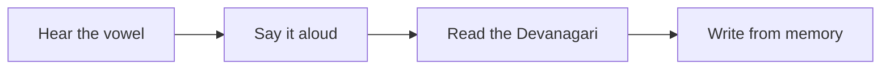

# Lesson 1: Sanskrit Vowels :icon[BookOpen]

Sanskrit begins with sound. Before words and sentences, learn the vowels — called **स्वराः** (*svarāḥ*, singular **स्वर** *svara*). The full set of Sanskrit letters together is called the **वर्णमाला** (*varṇamālā*, alphabet). Every syllable in the language rests on one of these sounds, so this is the perfect first step.

:::info{title="Key Sanskrit terms"}
| English | Sanskrit | IAST |
| --- | --- | --- |
| Alphabet | **वर्णमाला** | *varṇamālā* |
| Vowels | **स्वराः** | *svarāḥ* |
| Short vowels | **ह्रस्वस्वराः** | *hṛsvasvarāḥ* |
| Long vowels | **दीर्घस्वराः** | *dīrghasvarāḥ* |
| Anusvāra | **अनुस्वार** | *anusvāra* |
| Anunāsika | **अनुनासिक** | *anunāsika* |
| Visarga | **विसर्ग** | *visarga* |
:::

:::tip{title="How to use this lesson"}
Read each vowel aloud. Say the short sound, then its long partner right after it. Keeping the length clear is the single most important habit in Sanskrit pronunciation.
:::

## The Vowel Chart (स्वर)

Read the chart **column by column**, top to bottom, then move to the next column. This is the traditional order in which Sanskrit vowels are learned.

:letterGrid[Vowels]{rows="4" items="अ=a, आ=ā, इ=i, ई=ī, उ=u, ऊ=ū, ऋ=ṛ, ॠ=ṝ, ऌ=ḷ, ॡ=ḹ, ए=e, ऐ=ai, ओ=o, औ=au, अं=aṃ, अः=aḥ"}

:::note
The last two, **अं** (*aṃ*) and **अः** (*aḥ*), are the **अनुस्वार** (*anusvāra*) and **विसर्ग** (*visarga*). They are not pure vowels, but they always follow a vowel, so they are taught together with this group.
:::

## Short And Long Pairs

Most vowels come in a **short** (**ह्रस्व**, *hrasva*) and **long** (**दीर्घ**, *dīrgha*) pair. The long vowel is held about twice as long as the short one.

| Short | Long | Difference |
| --- | --- | --- |
| :letter[अ]{transliteration="a"} | :letter[आ]{transliteration="ā"} | hold the sound longer |
| :letter[इ]{transliteration="i"} | :letter[ई]{transliteration="ī"} | hold the sound longer |
| :letter[उ]{transliteration="u"} | :letter[ऊ]{transliteration="ū"} | hold the sound longer |
| :letter[ऋ]{transliteration="ṛ"} | :letter[ॠ]{transliteration="ṝ"} | hold the sound longer |
| :letter[ऌ]{transliteration="ḷ"} | :letter[ॡ]{transliteration="ḹ"} | hold the sound longer |

:::caution
`a` and `ā` are **different sounds**, not the same letter with decoration. Swapping them can change the meaning of a word.
:::

## Meet The First Four

Start by mastering just these four. Say each one three times before moving on.

:letter[अ]{transliteration="a" meaning="as in 'about'" size="big" highlight="true"}
:letter[आ]{transliteration="ā" meaning="as in 'father'" size="big"}
:letter[इ]{transliteration="i" meaning="as in 'sit'" size="big"}
:letter[ई]{transliteration="ī" meaning="as in 'machine'" size="big"}

## The Special Vowels

Sanskrit has **vocalic consonants** (ṛ, ṝ, ḷ, ḹ) — sounds that treat a consonant as a vowel — and **compound vowels** (ए, ऐ, ओ, औ) that glide between two sounds.

### Vocalic Consonants

:letter[ऋ]{transliteration="ṛ" meaning="like ரி in ரிஷி — syllabic r" size="big"}
:letter[ॠ]{transliteration="ṝ" meaning="like ரீ in ரீங்காரம் — long syllabic r" size="big"}
:letter[ऌ]{transliteration="ḷ" meaning="like ல் in கல் — syllabic l, Vedic" size="big"}
:letter[ॡ]{transliteration="ḹ" meaning="long ḷ — purely theoretical" size="big"}

| Vowel | IAST | Tamil hint | Note |
| --- | --- | --- | --- |
| ऋ | ṛ | **ரி** in **ரிஷி** (*ṛṣi*, sage) | Short syllabic r |
| ॠ | ṝ | **ரீ** in **ரீங்காரம்** (*rīṅkāram*, humming) | Long syllabic r |
| ऌ | ḷ | **ல்** in **கல்** (*kal*, stone) — sustain the l | Vedic only |
| ॡ | ḹ | — | Purely theoretical in classical grammar |

### Compound Vowels

:letter[ए]{transliteration="e" meaning="as in 'they'" size="big"}
:letter[ऐ]{transliteration="ai" meaning="as in 'aisle'" size="big"}
:letter[ओ]{transliteration="o" meaning="as in 'go'" size="big"}
:letter[औ]{transliteration="au" meaning="as in 'cow'" size="big"}

:::girl
Practising `ऐ` and `औ`? Glide smoothly from one sound into the next: `a` → `i` gives `ai`, and `a` → `u` gives `au`.
:::

## Quick Check

Reveal the answers only after you try.

- The long partner of **अ** (`a`) is [[आ|_____ (ā)]].
- The vowel that sounds like *machine* is [[ई|_____ (ī)]].
- **अः** is called the [[विसर्ग (visarga)]].

## Learning Flow

:::tip{title="Next lesson"}
Once these vowels feel natural, you are ready for the **consonants** (**व्यञ्जन**, *vyañjana*), where each consonant carries an inherent `a` sound.
:::
