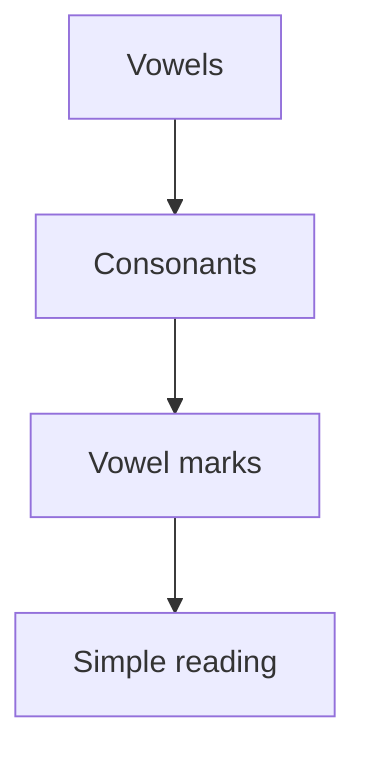
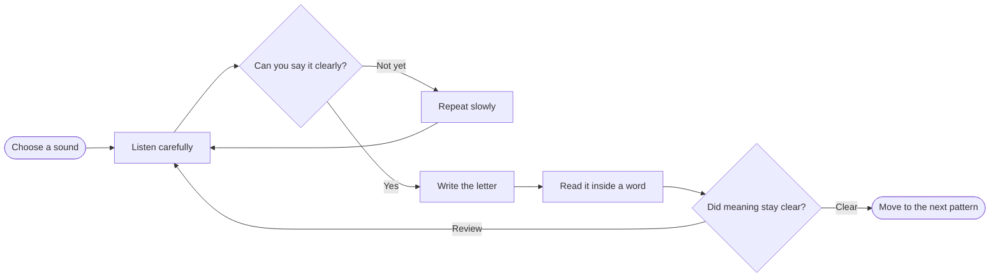
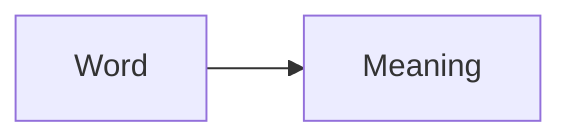

# Kannada Basics :icon[BookOpen]

Kannada is written with a rounded script. Start by recognizing vowels, then combine consonants and vowel marks.

:::note
Read slowly at first. Accuracy matters more than speed while the script is still new.
:::

## Script Shape

| Letter | Sound | Example Hint |
| --- | --- | --- |
| ಅ | a | short vowel |
| ಆ | aa | long vowel |
| ಕ | ka | consonant with vowel |
| ಕಿ | ki | consonant plus vowel mark |

## Reveal Practice

Use double brackets around the answer and a sentence template to make reveal practice. If the template does not include `___`, Lexora places the blank at the end of the sentence.

Write it like this:

- Blank at the end: `[[Kannada|The Kannada word ಕನ್ನಡ means]]`
- Blank anywhere: `[[ಕನ್ನಡ|The Kannada word ___ means Kannada.]]`

It appears like this:

[[Kannada|The Kannada word ಕನ್ನಡ means]]

[[ಕನ್ನಡ|The Kannada word ___ means Kannada.]]

## Callout Examples

Use callouts to mark learning hints, pronunciation reminders, and practice warnings.

Write a simple note like this:

```md
:::note
Read each new word aloud before writing it.
:::
```

:::note
Read each new word aloud before writing it.
:::

Add a custom title when the callout needs a clearer label:

```md
:::tip[Pronunciation Tip]
Say the vowel slowly, then attach it to the consonant.
:::
```

:::tip[Pronunciation Tip]
Say the vowel slowly, then attach it to the consonant.
:::

Use caution for mistakes learners should notice early:

```md
:::caution[Common Mix-up]
Do not treat long and short vowel sounds as the same sound.
:::
```

:::caution[Common Mix-up]
Do not treat long and short vowel sounds as the same sound.
:::

Use info for helpful context:

```md
:::info[Study Habit]
A small daily reading habit is better than one long weekly session.
:::
```

:::info[Study Habit]
A small daily reading habit is better than one long weekly session.
:::

Use danger sparingly for a serious warning:

```md
:::danger[Avoid This]
Do not memorize random word lists without reading them in sentences.
:::
```

:::danger[Avoid This]
Do not memorize random word lists without reading them in sentences.
:::

## Learning Flow



Here is a richer Mermaid example for planning a study loop:



## Markdown Features

Lexora articles support familiar markdown plus a few learning-focused helpers.

Use Lucide icons inline with `:icon[IconName]`.

```md
Great for practice :icon[Sparkles] and review :icon[BookOpen].
```

Great for practice :icon[Sparkles] and review :icon[BookOpen].

Find more icon names at [lucide.dev/icons](https://lucide.dev/icons). Use the PascalCase name shown by Lucide, such as `BookOpen`, `Languages`, `Brain`, `Volume2`, or `House`.

Use tables for compact vocabulary:

| Kannada | Transliteration | Meaning |
| --- | --- | --- |
| ನೀರು | neeru | water |
| ಮನೆ | mane | house |

Use code fences for examples, including Mermaid diagrams:

````md

````

Use reveal blanks for practice:

```md
[[water|The Kannada word ನೀರು means]]
[[ಮನೆ|The Kannada word ___ means house.]]
```

Use emoji labels for image-assisted reading. You can use built-in names like `house`, `water`, and `book`, or paste any emoji directly inside the brackets. Sizes are `normal`, `medium`, `big`, and `huge`. Add `meaningTamil` only when an extra Tamil meaning is useful.

```md
:emoji[house]{label="ಮನೆ" transliteration="mane" meaning="home" meaningTamil="வீடு" size="normal"}
:emoji[water]{label="ನೀರು" transliteration="neeru" meaning="water" size="medium"}
:emoji[book]{label="ಪುಸ್ತಕ" transliteration="pustaka" meaning="book" size="big"}
:emoji[🌳]{label="ಮರ" transliteration="mara" meaning="tree" size="huge"}
```

:emoji[house]{label="ಮನೆ" transliteration="mane" meaning="home" meaningTamil="வீடு" size="normal"} :emoji[water]{label="ನೀರು" transliteration="neeru" meaning="water" size="medium"} :emoji[book]{label="ಪುಸ್ತಕ" transliteration="pustaka" meaning="book" size="big"} :emoji[🌳]{label="ಮರ" transliteration="mara" meaning="tree" size="huge"}

For more emoji, use your OS emoji picker or a Unicode emoji list such as [unicode.org/emoji/charts/full-emoji-list.html](https://unicode.org/emoji/charts/full-emoji-list.html), then paste the emoji directly into `:emoji[😀]{...}`.

Use `textWord` when a word does not need an image. Add `meaningTamil` only when a rare extra Tamil meaning helps.

```md
:textWord[ಮನೆ]{transliteration="mane" meaning="home" meaningTamil="வீடு"}
:textWord[ನೀರು]{transliteration="neeru" meaning="water"}
```

:textWord[ಮನೆ]{transliteration="mane" meaning="home" meaningTamil="வீடு"}
:textWord[ನೀರು]{transliteration="neeru" meaning="water"}

Use `sentence` when a full sentence needs transliteration, meaning, or a rare Tamil meaning. Mark important words with `==highlight==`.

```md
:sentence[ಅವಳು ==ಮನೆಗೆ== ಹೋಗುತ್ತಾಳೆ]{transliteration="avalu manege hoguttale" meaning="She goes home." meaningTamil="அவள் வீட்டிற்கு செல்கிறாள்."}
:sentence[ಮಕ್ಕಳು ಶಾಲೆಯಲ್ಲಿ ==ಪುಸ್ತಕಗಳನ್ನು== ಓದುತ್ತಾರೆ]{transliteration="makkalu shaleyalli pustakagalannu oduttare" meaning="The children read books at school."}
```

:sentence[ಅವಳು ==ಮನೆಗೆ== ಹೋಗುತ್ತಾಳೆ]{transliteration="avalu manege hoguttale" meaning="She goes home." meaningTamil="அவள் வீட்டிற்கு செல்கிறாள்."}

:sentence[ಮಕ್ಕಳು ಶಾಲೆಯಲ್ಲಿ ==ಪುಸ್ತಕಗಳನ್ನು== ಓದುತ್ತಾರೆ]{transliteration="makkalu shaleyalli pustakagalannu oduttare" meaning="The children read books at school."}

## Character Conversations

Character conversations are useful for short teaching moments. Consecutive messages alternate sides automatically.

Write it like this:

```md
:::owl
Try reading the word slowly before guessing the meaning.
:::

:::unicorn
So I should notice the sound first, then the word?
:::
```

:::owl
Try reading the word slowly before guessing the meaning.
:::

:::unicorn
So I should notice the sound first, then the word?
:::

You can force a side with `align="right"` or `align="left"`.

```md
:::duck{align="right"}
Keep this reminder near the practice question.
:::
```

:::duck{align="right"}
Keep this reminder near the practice question.
:::
